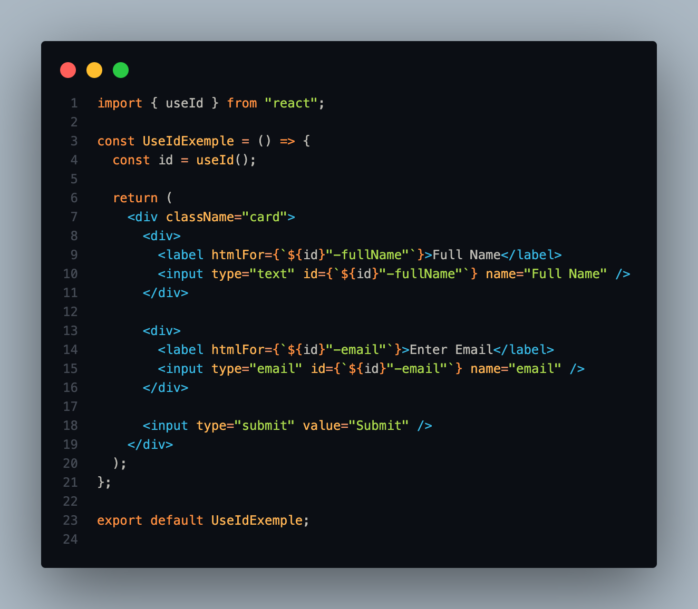
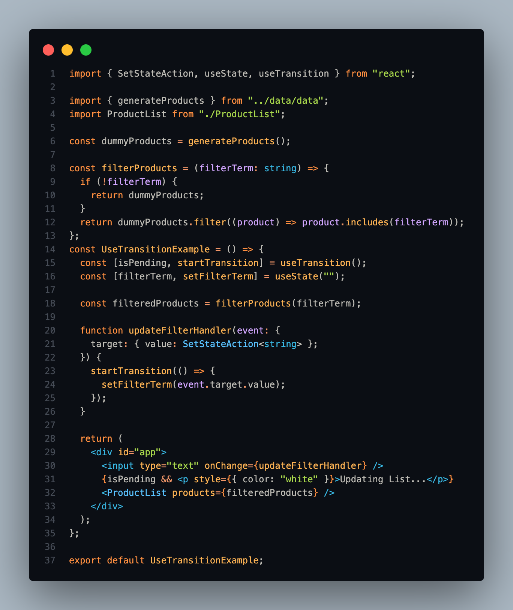

#  The Guide to New Hooks in React 18 

## About this Repository

# useId

The useId hook can be used to generate unique IDs that will be the same on the server- and client-side and thus help to avoid the mismatch error.

# useTransition

We can use the useTransition hook to tell React that a certain state change will result in an expensive rendering. React will then deprioritize this state change allowing other renderings to take place faster providing a very responsive UI. 

